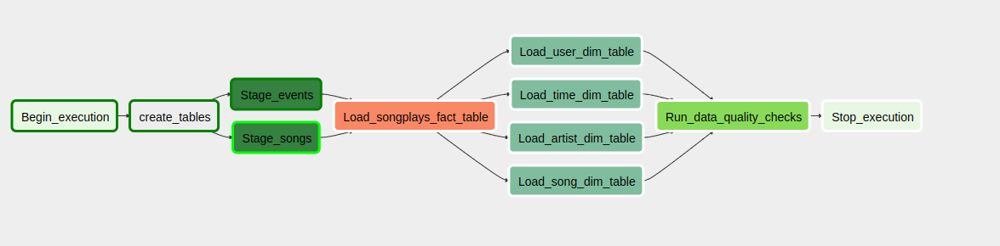

# Project - DW orchestration with airflow

A music streaming company, Sparkify, has decided that it is time to introduce more automation and monitoring to their data warehouse ETL pipelines and come to the conclusion that the best tool to achieve this is Apache Airflow.

They have decided to bring you into the project and expect you to create high grade data pipelines that are dynamic and built from reusable tasks, can be monitored, and allow easy backfills. They have also noted that the data quality plays a big part when analyses are executed on top the data warehouse and want to run tests against their datasets after the ETL steps have been executed to catch any discrepancies in the datasets.

The source data resides in S3 and needs to be processed in Sparkify's data warehouse in Amazon Redshift. The source datasets consist of JSON logs that tell about user activity in the application and JSON metadata about the songs the users listen to.


<h1> Files description </h1>

Plugins folder contains two repositories: helpers and operators. Helpers contains <code>ceate_tables.py</code> (that stores the DDLs for creating tables) and <code>sql_queries.py</code> (that stores the insert statements). Operators contains four python scripts (one for each operator): <code>data_quality.py</code>, <code>load_dimension.py</code>, <code>load_fact.py</code>, <code>stage_redshift.py</code>. Dags folder contains dag.py script, that loads Operators and set tasks dependencies.

DataQualityOperator - Check data quality of all tables, querying the number of records.

StageToRedshiftOperator - Extract data from Bucket S3 and insert into staging tables.

LoadFactOperator - Transform staging data and insert into fact table.

LoadDimensionOperator - Transform staging data and load dimensions.

This operators are used to extract, transform and load the data into a star schema (a fact songplay table and time, users, artists and songs DIM tables)



<h1> Data description </h1>

For this project, you'll be working with two datasets. Here are the s3 links for each:

Log data: s3://udacity-dend/log_data.

Song data: s3://udacity-dend/song_data.

Log_data brings information regarding the execution of songs by users in the application:

```javascript
{
    "artist":null,
    "auth":"Logged In",
    "firstName":"Celeste",
    "gender":"F",
    "itemInSession":1,
    "lastName":"Williams",
    "length":null,
    "level":"free",
    "location":"Klamath Falls, OR",
    "method":"GET",
    "page":"Home",
    "registration":1541077528796.0,
    "sessionId":52,
    "song":null,
    "status":200,
    "ts":1541207123796,
    "userAgent":"\"Mozilla\/5.0 (Windows NT 6.1; WOW64) AppleWebKit\/537.36 (KHTML, like Gecko) Chrome\/37.0.2062.103 Safari\/537.36\"",
    "userId":"53"
}
```
Song_data brings information regarding each music (song_id, title, duration, year) and its respective aritsts (artist_id, artist_longitude, artist_latitude, artist_location, artist_name)

```javascript
{
    "num_songs": 1,
    "artist_id": "ARMJAGH1187FB546F3",
    "artist_latitude": 35.14968,
    "artist_longitude": -90.04892,
    "artist_location": "Memphis, TN",
    "artist_name": "The Box Tops",
    "song_id": "SOCIWDW12A8C13D406",
    "title": "Soul Deep",
    "duration": 148.03546,
    "year": 1969
    }
```

<h1> Data Model </h1>

staging_songs - STG related to songs;

staging_events - STG related to events;

time - DIM related to time;

users - DIM related to app users;

artists - DIM related to the artists of the songs that played in the app;

songs - DIM related to the songs played in the app;

songplays - FACT related to the playing songs in the app;

